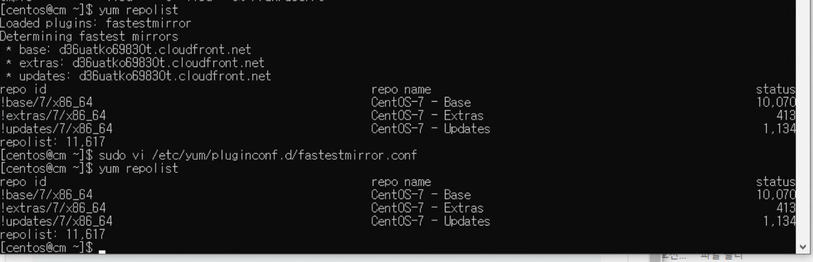

# 최종 Assessment - 사공태정 

#Part1

### 접속

* Host1 : `ssh -i SKCC_Final.pem centos@3.35.99.0`

* Host2 : `ssh -i SKCC_Final.pem centos@52.78.113.180`

* Host3 : `ssh -i SKCC_Final.pem centos@52.78.121.88`

* Host4 : `ssh -i SKCC_Final.pem centos@52.78.15.180`

* Host5 : `ssh -i SKCC_Final.pem centos@52.78.186.31`


### 환경 세팅

* 비밀 번호 세팅

`sudo passwd centos`

_password : centos_
 
`sudo vi /etc/ssh/sshd_config`

```
PasswordAuthentication yes
```

`sudo service sshd restart`

`ssh centos@[ip]`


# 1. Create a CDH Cluster on AWS

##a. Linux setup
Add the following linux accounts to all nodes
 1. User training with a UID of 3800
 2. Set the password for user “training” to “training” 
 3. Create the group skcc and add training to it
 4. Give training sudo capabilities
 
 ```
 sudo useradd training
 sudo echo ‘training’ | sudo passwd --stdin training
 sudo usermod -u 3800 training

 sudo groupadd skcc
 sudo usermod -g skcc training
 
 sudo chmod +w /etc/sudoers
 sudo vi /etc/sudoers
 training    ALL=(ALL)   NOPASSWD: ALL
 sudo chmod -w /etc/sudoers

```
 

List the your instances by IP address and DNS name (don’t use /etc/hosts for this)

* 호스트 세팅

  `sudo hostnamectl set-hostname cm.bdai.com`
  `sudo hostnamectl set-hostname m1.bdai.com`
  `sudo hostnamectl set-hostname d1.bdai.com`
  `sudo hostnamectl set-hostname d2.bdai.com`
  `sudo hostnamectl set-hostname d3.bdai.com`

  `sudo vi /etc/hosts`

  ```
  10.0.0.111  cm.bdai.com cm
  10.0.0.239  m1.bdai.com m1
  10.0.0.177   d1.bdai.com d1
  10.0.0.124  d2.bdai.com d2
  10.0.0.174  d3.bdai.com d3
  ```

  `getent hosts`
  
  세팅 후 재접속
 

List the Linux release you are using
List the file system capacity for the first node (master node)

```
df -h
```
 
 
List the command and output for yum repolist enabled
```
sudo vi /etc/yum/pluginconf.d/fastestmirror.conf
enabled=0
yum repolist

```
 
 
 
List the /etc/passwd entries for training (only in master name node) 
List the /etc/group entries for skcc (only in master name node)

```
sudo cat /etc/passwd | grep training
sudo cat /etc/group | gerp skcc

```
 

List output of the flowing commands:
 1. getent group skcc
 2. getent passwd training

```
getent group skcc
getent passwd training

```
 


##b. Install a MySQl server
Use MariaDB as the database for all the services. 
You may choose your own username and passwords but make a record of it so that we may access them.

_모든 서버에 설치_

#### 1. 자바 설치

 * 1.8 버전 open jdk
 
`sudo yum install -y java-1.8.0-openjdk-devel`


#### 2. 자바 홈 환경 변수 추가

`sudo vi /etc/profile`

* 1.8 버전 open jdk

```shell
export JAVA_HOME=/usr/lib/jvm/java-1.8.0-openjdk/jre
export PATH=$PATH:$JAVA_HOME/bin
```
세팅 후 재접속

```
echo $JAVA_HOME
```

 

### 3. Install a supported JDBC Connector

_모든 서버에 설치_

`wget https://dev.mysql.com/get/Downloads/Connector-J/mysql-connector-java-5.1.49.tar.gz`

`tar zxvf mysql-connector-java-5.1.49.tar.gz`

`sudo mkdir -p /usr/share/java/`

`cd mysql-connector-java-5.1.49`

`sudo cp mysql-connector-java-5.1.49-bin.jar /usr/share/java/mysql-connector-java.jar`

### 4. Install Databases (MariaDB)

_CM 서버에 설치_

`sudo yum install mariadb-server`

`sudo systemctl stop mariadb`

`sudo vi /etc/my.cnf`

```shell
[mysqld]
datadir=/var/lib/mysql
socket=/var/lib/mysql/mysql.sock
transaction-isolation = READ-COMMITTED
# Disabling symbolic-links is recommended to prevent assorted security risks;
# to do so, uncomment this line:
symbolic-links = 0
# Settings user and group are ignored when systemd is used.
# If you need to run mysqld under a different user or group,
# customize your systemd unit file for mariadb according to the
# instructions in http://fedoraproject.org/wiki/Systemd

key_buffer = 32M
# (deprecated) key_buffer_size = 32M
max_allowed_packet = 32M
thread_stack = 256K
thread_cache_size = 64
query_cache_limit = 8M
query_cache_size = 64M
query_cache_type = 1

max_connections = 550
#expire_logs_days = 10
#max_binlog_size = 100M

#log_bin should be on a disk with enough free space.
#Replace '/var/lib/mysql/mysql_binary_log' with an appropriate path for your
#system and chown the specified folder to the mysql user.
log_bin=/var/lib/mysql/mysql_binary_log

#In later versions of MariaDB, if you enable the binary log and do not set
#a server_id, MariaDB will not start. The server_id must be unique within
#the replicating group.
server_id=1

binlog_format = mixed

read_buffer_size = 2M
read_rnd_buffer_size = 16M
sort_buffer_size = 8M
join_buffer_size = 8M

# InnoDB settings
innodb_file_per_table = 1
innodb_flush_log_at_trx_commit  = 2
innodb_log_buffer_size = 64M
innodb_buffer_pool_size = 4G
innodb_thread_concurrency = 8
innodb_flush_method = O_DIRECT
innodb_log_file_size = 512M

[mysqld_safe]
log-error=/var/log/mariadb/mariadb.log
pid-file=/var/run/mariadb/mariadb.pid

#
# include all files from the config directory
#
!includedir /etc/my.cnf.d
```
-----

`sudo systemctl enable mariadb`

`sudo systemctl start mariadb`

`sudo /usr/bin/mysql_secure_installation`

```
[...]
Enter current password for root (enter for none):
OK, successfully used password, moving on...
[...]
Set root password? [Y/n] Y
New password:
Re-enter new password:
[...]
Remove anonymous users? [Y/n] Y
[...]
Disallow root login remotely? [Y/n] N <--
[...]
Remove test database and access to it [Y/n] Y
[...]
Reload privilege tables now? [Y/n] Y
[...]
All done!  If you've completed all of the above steps, your MariaDB
installation should now be secure.

Thanks for using MariaDB!
```

_password : 1234_

### 5. Create the databases and access grants you will need

`mysql -u root -p`

`CREATE DATABASE scm DEFAULT CHARACTER SET utf8 DEFAULT COLLATE utf8_general_ci;`

`GRANT ALL ON scm.* TO 'scm'@'%' IDENTIFIED BY '1234';`

`CREATE DATABASE amon DEFAULT CHARACTER SET utf8 DEFAULT COLLATE utf8_general_ci;`

`GRANT ALL ON amon.* TO 'amon'@'%' IDENTIFIED BY '1234';`

`CREATE DATABASE rman DEFAULT CHARACTER SET utf8 DEFAULT COLLATE utf8_general_ci;`

`GRANT ALL ON rman.* TO 'rman'@'%' IDENTIFIED BY '1234';`

`CREATE DATABASE hue DEFAULT CHARACTER SET utf8 DEFAULT COLLATE utf8_general_ci;`

`GRANT ALL ON hue.* TO 'hue'@'%' IDENTIFIED BY '1234';`

`CREATE DATABASE metastore DEFAULT CHARACTER SET utf8 DEFAULT COLLATE utf8_general_ci;`

`GRANT ALL ON metastore.* TO 'hive'@'%' IDENTIFIED BY '1234';`

`CREATE DATABASE sentry DEFAULT CHARACTER SET utf8 DEFAULT COLLATE utf8_general_ci;`

`GRANT ALL ON sentry.* TO 'sentry'@'%' IDENTIFIED BY '1234';`

`CREATE DATABASE nav DEFAULT CHARACTER SET utf8 DEFAULT COLLATE utf8_general_ci;`

`GRANT ALL ON nav.* TO 'nav'@'%' IDENTIFIED BY '1234';`

`CREATE DATABASE navms DEFAULT CHARACTER SET utf8 DEFAULT COLLATE utf8_general_ci;`

`GRANT ALL ON navms.* TO 'navms'@'%' IDENTIFIED BY '1234';`

`CREATE DATABASE oozie DEFAULT CHARACTER SET utf8 DEFAULT COLLATE utf8_general_ci;`

`GRANT ALL ON oozie.* TO 'oozie'@'%' IDENTIFIED BY '1234';`


List the following in your GitHub
1. A command and output that shows the hostname of your database server
2. A command and output that reports the database server version
3. A command and output that lists all the databases in the server

```
SHOW VARIABLES WHERE Variable_name = 'hostname';
SELECT VERSION();
show databases;

```


## c.Install Cloudera Manager
i. Specifically, you MUST install CDH version 5.15.2 You will lose points if you install any other version of CDH.

## install using CM 5.15.x

### 1. Configure a Repository for Cloudera Manager

_모든 서버에 설치_

`sudo yum install -y wget`

`sudo vi /etc/yum.repos.d/cloudera-manager.repo`

```
[cloudera-manager]
name = Cloudera Manager, Version 5.15.2
baseurl = https://archive.cloudera.com/cm5/redhat/7/x86_64/cm/5.15.2/
gpgkey = https://archive.cloudera.com/redhat/cdh/RPM-GPG-KEY-cloudera
gpgcheck = 1
```

`sudo rpm --import https://archive.cloudera.com/cm5/redhat/7/x86_64/cm/RPM-GPG-KEY-cloudera`

### 2. Install Cloudera Manager Server

_CM 서버에 설치_

`sudo yum install cloudera-manager-daemons cloudera-manager-server`

`sudo vi /etc/default/cloudera-scm-server`

```shell
export CM_JAVA_OPTS="-Xmx4G ..."
```

### 3. Set up the Cloudera Manager Database

_CM 서버에 설치_

`sudo /usr/share/cmf/schema/scm_prepare_database.sh mysql scm scm 1234`

### 4. Install CDH and Other Software

_CM 서버에 설치_

`sudo systemctl start cloudera-scm-server`

`sudo tail -f /var/log/cloudera-scm-server/cloudera-scm-server.log`

준비 완료 시 출력 : `INFO WebServerImpl:com.cloudera.server.cmf.WebServerImpl: Started Jetty server.`

`http://3.35.99.0:7180` 접속 후 admin / admin 으로 로그인

ii. The Cluster does not have to be in HA mode.

iii. Make sure that the following services (and any necessary services to
install that service) are installed: 
1. HDFS
2. YARN 
3. Sqoop 
4. Hive 
5. Impala 
6. HUE


iv. In you cluster, create a user named “training” with password “training”
    1. You should have already created the linux user from previous
        step. Now, make sure user “training” has both a linux and HDFS home directory
        


# Part2

#1


#2


#3


#4


#5


#6


